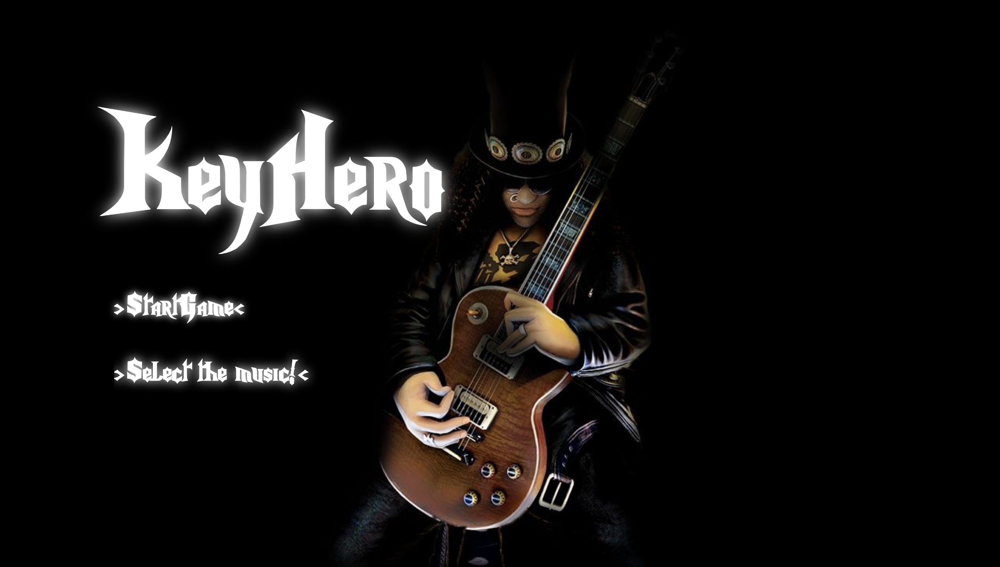

# KeyHero
> "KeyHero" is a game build in HTML canvas, CSS and Javascript.

#### TLDR: https://felipespadua.github.io/keyhero/

## Installation

Clone or download this project, open the index.html file in your browser and have Fun. Or just click in this [link](https://felipespadua.github.io/keyhero/)!

## Usage example

Instructions to play this game:

* Use your Keyboard
* Select the music.
* Click on Start Game.
* Tap the key when in the keyzone.

## Meta

Felipe Sekkar de Padua – felipespadua@gmail.com

Distributed under the Creative Commons license - Attribution-NonCommercial 4.0 International (CC BY-NC 4.0). See CC LICENSE for more information.

[https://github.com/felipespadua/github-link](https://github.com/felipespadua/)

## Contributing
>This is a free software, feel free to contribute in any way you want

1. Fork it (<https://github.com/felipespadua/keyhero/fork>)
2. Create your feature branch (`git checkout -b feature/fooBar`)
3. Commit your changes (`git commit -am 'Add some fooBar'`)
4. Push to the branch (`git push origin feature/fooBar`)
5. Create a new Pull Request
